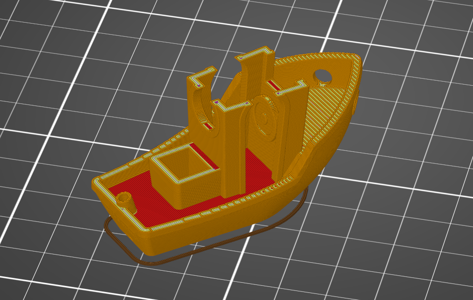

3D printing, as we know it today, is a relatively new technique for production of parts by adding more and more material on-top of a buildplate. Material ranging from a wide range of plastics to a wide range of metals. Doing 3D printing with an articulated manipulator instead of a cartesian manipulator/gantry robot enables greater build volume, ability to deposit material form different angles and the ability to building in non-horizontal layers.

In this specialization project, you will be tasked with making a ROS package that will take G-code from a slicer software and generate trajectories for a robot manipulator. This will be used to 3D print with a franka robot, and will later serve as a baseline for comparison in research of closed-loop control for additive manufacturing (3D-printing). A goal is that the ROS package should be general enough that it can be used with other robots and applications.

## Prerequisites ##

1. Experience with Ubuntu and git
2. Experience with Python or C++
3. Experience or interest in learning ROS

## Tasks ##

1. Familiarize yourself with the standard pipeline for fused filament fabrication (FFF) (plastic 3D-printing).
2. Familiarize yourself with ROS as a platform for control of robot minipulators.
3. Write a ROS package that takes G-code from a slicer and generates trajectories for an articulated manipulator for the purpose of 3D printing.
4. Test the ROS package with a franka robot in the lab.
5. Write a report on the work.

## Further work ##

Depending on how the project goes, one could explore ways of doing 3D printing in non-horizontal layers, or follow up on ideas that emerges under way.

## Contacts ##
1. Andreas Hanssen Moltumyr - Project Lead
2. Jan Tommy Gravdahl - Main supervisor

Fig. 1: Franka Emika Panda robot with a custom built FDM extruder.

Fig. 2: Preview of extruder trajectories for benchy model in a slicer software.