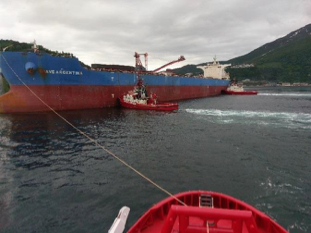

Automation of port operations are currently receiving a considerable amount of attention, due to the combination of new technological breakthroughs making such operations possible, and the projected gains in port throughput, safety and reliability, and operating costs. Of particular interest in this respect is the use of tugboat-assisted docking of large vessels, which has significant potential for improvement. Vessels in need of tugboat assistance are usually massive, and controlled with a configuration of aft propellers and rudders. Vessel maneuvering requires forward velocity, and acceleration require long distances and time. When reaching the port, vessels reduce velocity to a dead slow, severely reducing maneuverability. The final maneuvering into the dock is assisted by tugboats, strategicallypositioned around the hull to provide push/pull forces. Successful vessel maneuvering with high performance requires reliable tugboat coordination, typically ensured with highly qualified helmsmen performing manual tugboat control, as well as robust communication links between the tugboats and vessel pilot.

This project focuses on developing advanced automatic control solutions to support automated tugboat-assisted docking operations. The challenging problems related to automatic docking lend themselves to solution through advanced nonlinear automatic control theory, thereby enabling fully automated vessel docking with improved efficiency and reliability. The requirement of highly skilled helmsmen will be relaxed, as the control algorithms will optimally control the tugboats to provide necessary forces for vessel maneuvering, and optimize time and power consumption as well as safety in the docking operation. In particular, the project includes the following subtasks:

## Tasks ##

1.	Perform a literature review on automated ship docking and berthing operations.
2.	Develop the mathematical model for a specific case of a porting vessel and supporting tugboats. 
3.	Develop a guidance and control algorithms for the porting vessel under ideal conditions, without considering tugboat constraints.
4.	Based on the outcome of task 2, develop guidance and control strategies for the tugboats under relaxing assumptions of continuous contact and no-slip conditions 

## Contacts ##
1. Raymond Kristiansen, The Arctic university of Norway, Narvik - Project Lead
2. Jan Tommy Gravdahl - Main supervisor

Fig. 1: Tugboat assisted docking.

